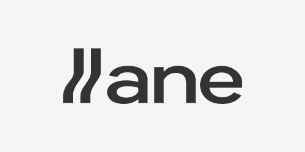

<p align="center">
  
</p>

<h1 align="center">lane</h1>

<p align="center">
  <strong>Parallel development lanes for AI-assisted coding</strong>
</p>

<p align="center">
  <a href="#installation">Installation</a> •
  <a href="#quick-start">Quick Start</a> •
  <a href="#commands">Commands</a> •
  <a href="#configuration">Configuration</a> •
</p>

<p align="center">
  <a href="https://github.com/dlinardi/lane/actions/workflows/ci.yml"></a>
  <a href="https://github.com/dlinardi/lane/releases"></a>
  <a href="https://goreportcard.com/report/github.com/dlinardi/lane"></a>
  <a href="LICENSE"></a>
</p>

---

<!-- TODO: Add demo GIF here -->
<!-- <p align="center">
  
</p> -->

## The Problem

When using AI coding assistants like OpenCode, Claude Code, or Codex, you often want to work on multiple tickets simultaneously. But the traditional workflow breaks down:

- 🔄 **Branch switching interrupts running AI sessions**
- 🧠 **Context is lost between switches**
- 😵 **Easy to make changes on the wrong branch**
- ⏳ **Can't truly parallelise work**

## The Solution

**lane** uses git worktrees to create isolated directories for each ticket. Combined with tmux, you get:

- ✅ Multiple AI sessions running simultaneously
- ✅ Complete isolation between tickets
- ✅ No branch-switching confusion
- ✅ Easy context switching via tmux windows

Each ticket gets its own worktree, its own branch, its own tmux window, and its own AI agent session.

---

## Installation

### Homebrew (macOS/Linux)

```bash
brew install dlinardi/tap/lane
```

### Go Install

```bash
go install github.com/dlinardi/lane@latest
```

### Binary Download

```bash
curl -sSL https://raw.githubusercontent.com/dlinardi/lane/main/install.sh | sh
```

### From Source

```bash
git clone https://github.com/dlinardi/lane.git
cd lane
make install
```

---

## Quick Start

```bash
# 1. Initialise lane in your repo
cd ~/projects/my-app
lane init

# 2. Start working on a ticket
lane new air-800 track-referrals

# You're now in a new tmux window, on branch feat/air-800/track-referrals
# with your AI agent ready to go!

# 3. Create another lane for parallel work
lane new air-801 fix-auth-bug --type fix

# 4. Switch between lanes
lane go air-800

# 5. See all your active lanes
lane ls

# 6. Clean up when done
lane done air-800
```

---

## Commands

| Command | Description |
|---------|-------------|
| `lane init` | Initialise lane in a repository |
| `lane new <ticket> [desc]` | Create a new lane (worktree + branch + tmux window) |
| `lane ls` | List all active lanes |
| `lane go <ticket>` | Switch to a lane's tmux window |
| `lane status [ticket]` | Show detailed status of lanes |
| `lane done <ticket>` | Clean up a completed lane |
| `lane config` | View or edit configuration |

### `lane new`

```bash
# Basic usage
lane new air-800 implement-oauth

# With quoted description (auto-kebab-cased)
lane new air-800 "implement OAuth flow"

# Different branch type
lane new air-800 fix-null-pointer --type fix

# Branch from different base
lane new air-800 hotfix --base main

# Don't auto-launch AI agent
lane new air-800 quick-fix --no-agent
```

### `lane ls`

```
TICKET      BRANCH                           STATUS    CREATED
air-800     feat/air-800/track-referrals     3 ahead   2h ago
air-801     fix/air-801/null-pointer         1 ahead   45m ago
air-802     chore/air-802/update-deps        clean     10m ago
```

### `lane go`

```bash
# Exact match
lane go air-800

# Fuzzy match
lane go 800        # Matches air-800
lane go track      # Matches by description if unique
```

### `lane done`

```bash
# Normal cleanup (warns if not merged)
lane done air-800

# Force cleanup even if not merged
lane done air-800 --force

# Keep the branch after cleanup
lane done air-800 --keep-branch
```

---

## Configuration

lane stores its configuration in `.lane/config.toml` within your repository.

### Initialise with Defaults

```bash
lane init --defaults
```

### Interactive Setup

```bash
lane init
# Prompts for: base branch, ticket type, AI agent, etc.
```

### Example Configuration

```toml
# .lane/config.toml

# Default branch to create lanes from
default_base = "develop"

# Default branch type prefix
default_type = "feat"

# Branch naming pattern
branch_pattern = "{type}/{ticket}/{description}"

# Where to store worktrees
worktree_location = "nested"  # or "sibling"

[agent]
enabled = true
command = "opencode"  # or "claude", "aider", "codex", etc.

[tmux]
auto_session = true
session_name = "lanes"

[ui]
color = true
```

### Edit Configuration

```bash
# View current config
lane config

# Edit in your $EDITOR
lane config edit

# Set a specific value
lane config set default_base main
lane config set agent.command aider
```

---

## How It Works

lane combines three powerful tools:

1. **Git Worktrees** — Multiple working directories sharing the same repository
2. **tmux** — Terminal multiplexer for managing multiple sessions
3. **AI Agents** — OpenCode, Claude Code, Codex, or any CLI-based AI assistant

When you run `lane new air-800 track-referrals`:

1. Creates a worktree at `.lane/worktrees/air-800/`
2. Creates branch `feat/air-800/track-referrals` from your base branch
3. Opens a new tmux window named `air-800`
4. Changes to the worktree directory in that window
5. Launches your configured AI agent

Each lane is completely isolated — different directory, different branch, different AI session.

---

## Requirements

- **Git** 2.20+ (for worktree support)
- **tmux** 3.0+ (optional but recommended)
- **Go** 1.22+ (if building from source)

### tmux Note

tmux is optional but highly recommended. Without tmux:
- `lane new` creates the worktree and branch but won't create a window
- `lane go` prints instructions instead of switching
- You can still use multiple terminals manually

---

## Supported AI Agents

lane works with any CLI-based AI coding assistant:

| Agent | Config |
|-------|--------|
| [OpenCode](https://github.com/opencode-ai/opencode) | `agent.command = "opencode"` |
| [Claude Code](https://claude.ai/code) | `agent.command = "claude"` |
| [Codex CLI](https://github.com/openai/codex) | `agent.command = "codex"` |
| [Aider](https://aider.chat) | `agent.command = "aider"` |

Or any other command:
```toml
[agent]
command = "your-agent-command"
args = ["--some", "--flags"]
```

---

## Roadmap

- [x] Core commands (init, new, ls, go, done)
- [x] tmux integration
- [x] Configuration system
- [ ] Interactive TUI mode
- [ ] `lane sync` — rebase all lanes
- [ ] `lane pr` — open PR via gh cli
- [ ] VS Code extension

---

## Licence

[MIT](LICENSE) © David Linardi
